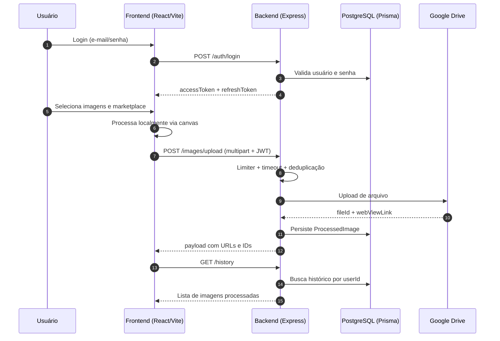
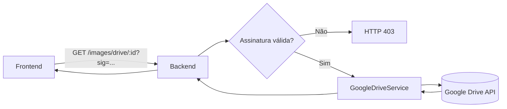
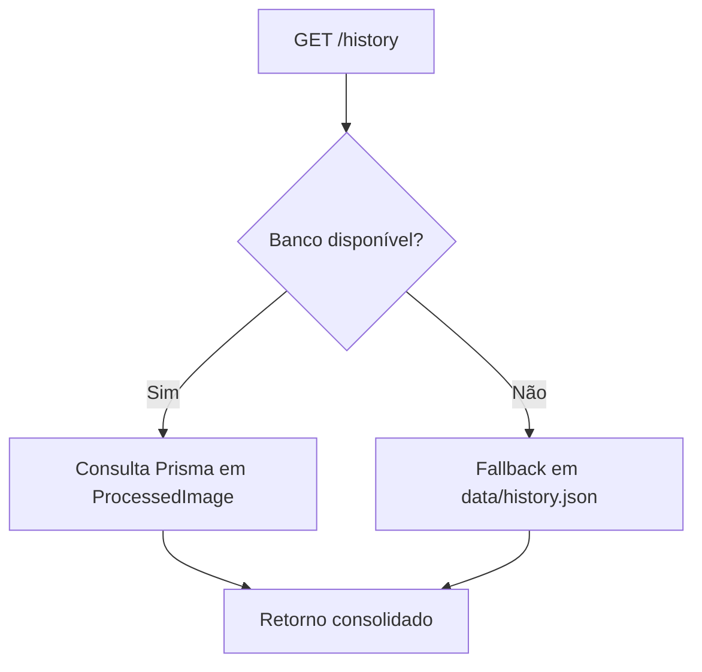

# DIAGRAMS

## 1) Ciclo de vida principal do dado (usuário -> API -> banco -> Drive)

```mermaid
sequenceDiagram
    autonumber
    participant U as Usuário
    participant FE as Frontend (React/Vite)
    participant API as Backend (Express)
    participant DB as PostgreSQL (Prisma)
    participant GD as Google Drive

    U->>FE: Login (e-mail/senha)
    FE->>API: POST /auth/login
    API->>DB: Valida usuário e senha
    API-->>FE: accessToken + refreshToken

    U->>FE: Seleciona imagens e marketplace
    FE->>FE: Processa localmente via canvas
    FE->>API: POST /images/upload (multipart + JWT)
    API->>API: Limiter + timeout + deduplicação
    API->>GD: Upload de arquivo
    GD-->>API: fileId + webViewLink
    API->>DB: Persiste ProcessedImage
    API-->>FE: payload com URLs e IDs

    FE->>API: GET /history
    API->>DB: Busca histórico por userId
    API-->>FE: Lista de imagens processadas
```

## 2) Fluxo de proteção de imagem via proxy assinado

```mermaid
flowchart LR
    FE[Frontend] -->|GET /images/drive/:id?sig=...| API[Backend]
    API --> SIGN{Assinatura válida?}
    SIGN -->|Não| ERR[HTTP 403]
    SIGN -->|Sim| DRIVE[GoogleDriveService]
    DRIVE --> GD[(Google Drive API)]
    GD --> DRIVE
    DRIVE --> API
    API --> FE
```

## 3) Modo degradado de histórico

```mermaid
flowchart TD
    A[GET /history] --> B{Banco disponível?}
    B -->|Sim| C[Consulta Prisma em ProcessedImage]
    B -->|Não| D[Fallback em data/history.json]
    C --> E[Retorno consolidado]
    D --> E
```
