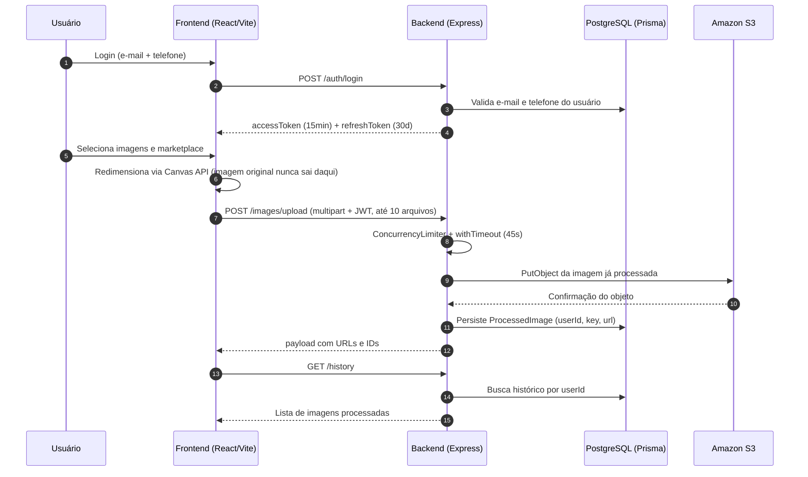
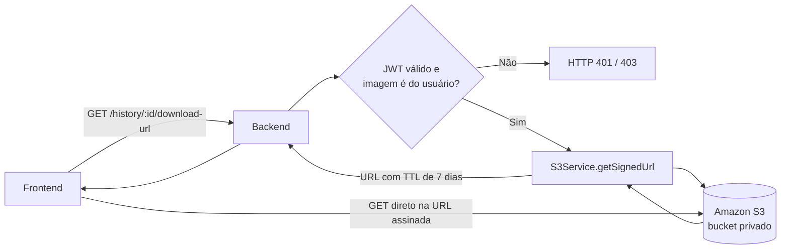
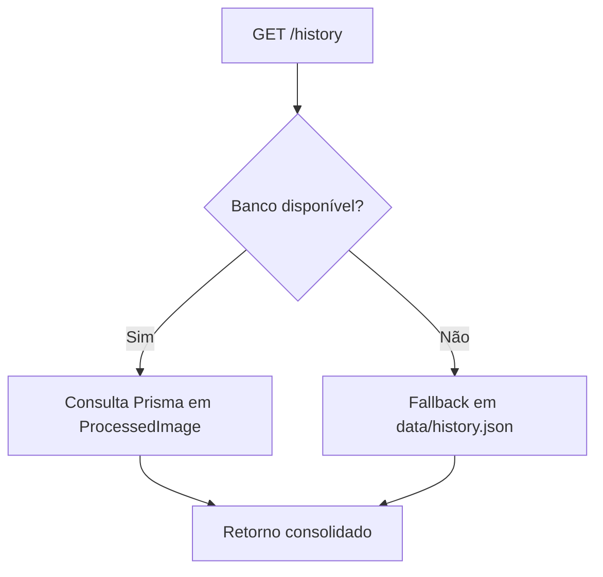

# DIAGRAMS

> Os diagramas refletem o código desta branch. Ao mudar rota, storage ou fluxo de
> autenticação, atualize aqui junto com o código — diagrama desatualizado engana
> mais do que ausência de diagrama.

## 1) Ciclo de vida principal do dado (usuario -> API -> banco -> S3)

## 2) Download de imagem do histórico via URL pré-assinada

O bucket permanece privado. O backend nunca faz proxy do binário: ele assina uma
URL temporária e o navegador busca o objeto direto no S3, o que tira a
transferência do caminho da instância EC2.

## 3) Modo degradado de histórico

O fallback em arquivo mantém o histórico legível quando o Postgres está fora.
Não é thread-safe entre processos e os dados se perdem em ambiente efêmero —
é rede de segurança e ambiente de demo, não substituto do banco.
